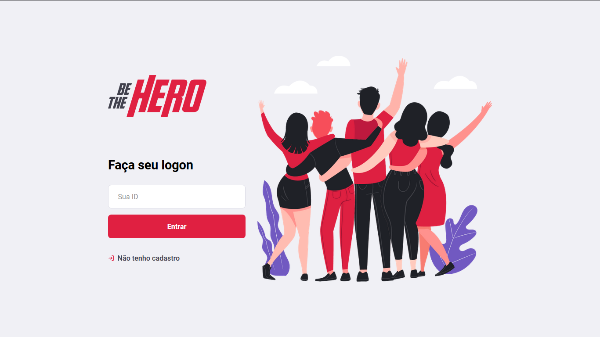

<h1 align="center">
    
</h1>

<h1 align="center">Be The Hero</h1>

# Sobre

Be The Hero é um app desenvolvido durante o evento nomeado **Semana OmniStack 11.0** que ocorreu durante os dias 23/03/20 e 29/09/20. Foram desenvolvidos **Back-end / Front-end + App Mobile** que tem como proposta, armazenar ONGs e suas causas e permitir que usuários do aplicativo possam ajudá-las; Utilizando as principais tecnologias disponíveis no mercado:

## back-end:

- express
- knexJS
- sqlite3

## front-end:
- react
- axios

<h1 align="center">
    
    
    
    
</h1>

## aplicação mobile:

- react native
- expo
- axios

<h1 align="center">
    
    
    
</h1>
